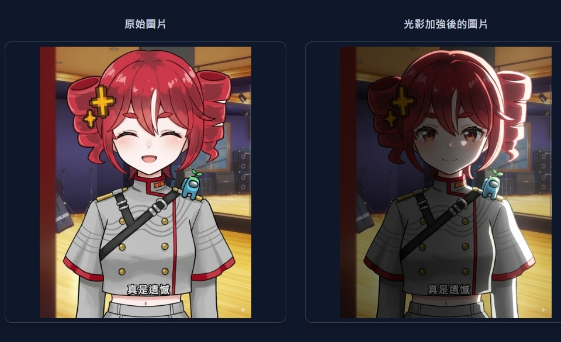

# Nano Banana Illumination

**Live Demo**: [AI Studio App](https://ai.studio/apps/drive/1xe5kL2n2E2D02VwKio2qQVh23KR6KPuW)

A powerful AI-driven photo lighting editor that uses Google's Gemini AI to apply professional lighting presets and exposure corrections to your images.



## Features

### Exposure Fixes

- **Fix Overexposure**: Reduce highlight intensity while preserving detail in bright areas
- **Fix Underexposure**: Brighten shadow regions without washing out midtones
- **Balance Dynamic Range**: Apply adaptive tone mapping for even exposure
- **Natural HDR**: Blend multiple simulated exposures for natural-looking results

### Professional Lighting Presets

- **Remove All Light**: Create a dark, mysterious base for custom lighting
- **Frontal Keylight + Rim Light**: Even facial illumination with natural glow
- **Three-Point Lighting**: Classic cinematic setup with key, fill, and back lights
- **Rembrandt Lighting**: Dramatic portrait lighting with characteristic triangle
- **Split Lighting**: High-contrast single-side illumination
- **Butterfly Lighting**: Glamorous overhead lighting for beauty shots
- **Loop Lighting**: Natural, flattering portrait illumination
- **Clamshell Lighting**: Smooth, magazine-style beauty effect
- **Low Angle Uplight**: Dramatic upward lighting for intensity
- **Side Rim Glow**: Edge definition with glowing contours
- **High-Contrast Spotlight**: Theatrical, isolated emphasis
- **Soft Ambient Wash**: Even, natural daylight effect
- **Colored Dual-Tone**: Stylized warm/cool two-tone lighting

### User Interface

- Drag-and-drop image upload (PNG, JPG, WEBP supported)
- Real-time AI processing with loading indicators
- Side-by-side image comparison
- Multilingual support (English and Traditional Chinese)
- Responsive design for desktop and mobile
- Dark theme with modern UI

## Technology Stack

- **Frontend**: React 19, TypeScript, Vite
- **AI Service**: Google Gemini 2.5 Flash Image Preview
- **Internationalization**: i18next, react-i18next
- **Styling**: Tailwind CSS (inferred from class names)
- **Build Tool**: Vite with TypeScript support

## Prerequisites

- Node.js (version compatible with React 19)
- Google Gemini API key

## Installation

1. Clone the repository:

   ```bash
   git clone https://github.com/sam3u7858/nano-banana-illumination.git
   cd nano-banana-illumination
   ```

2. Install dependencies:

   ```bash
   npm install
   ```

3. Set up environment variables:
   Create a `.env.local` file in the root directory and add your Gemini API key:

   ```
   API_KEY=your_gemini_api_key_here
   ```

4. Start the development server:
   ```bash
   npm run dev
   ```

## Usage

1. **Upload an Image**: Drag and drop or click to upload a photo (PNG, JPG, or WEBP)
2. **Choose a Preset**: Select from exposure fixes or lighting presets
3. **View Results**: Compare the original and AI-enhanced image side by side
4. **Download or Reuse**: Download the result or use it as input for further editing

## API Configuration

The application uses Google's Gemini AI service for image processing. You'll need to:

1. Get a Gemini API key from [Google AI Studio](https://ai.google.dev/)
2. Add the API key to your `.env.local` file
3. Ensure your API key has access to the `gemini-2.5-flash-image-preview` model

## Build Commands

- `npm run dev`: Start development server
- `npm run build`: Build for production
- `npm run preview`: Preview production build

## Project Structure

```
├── components/           # React components
│   ├── CollapsibleSection.tsx
│   ├── CustomPrompt.tsx
│   ├── ImageDisplay.tsx
│   ├── ImageUploader.tsx
│   ├── LanguageSwitcher.tsx
│   └── PresetSelector.tsx
├── services/            # API services
│   └── geminiService.ts
├── assets/             # Static assets
├── constants.ts        # Lighting presets and configurations
├── i18n.ts            # Internationalization setup
├── types.ts           # TypeScript type definitions
├── App.tsx            # Main application component
└── index.tsx          # Application entry point
```

## Contributing

This project is designed and maintained by a world-class senior frontend React engineer. Contributions are welcome through pull requests.

## License

This project is created for educational and demonstration purposes. Please ensure you comply with Google's Gemini API terms of service when using this application.

## Links

- **GitHub Repository**: [nano-banana-illumination](https://github.com/sam3u7858/nano-banana-illumination)
- **Creator**: [@Bmonlive](https://www.youtube.com/@bmonlive)
- **Website**: [BMon.tw](https://bmon.tw/a)
